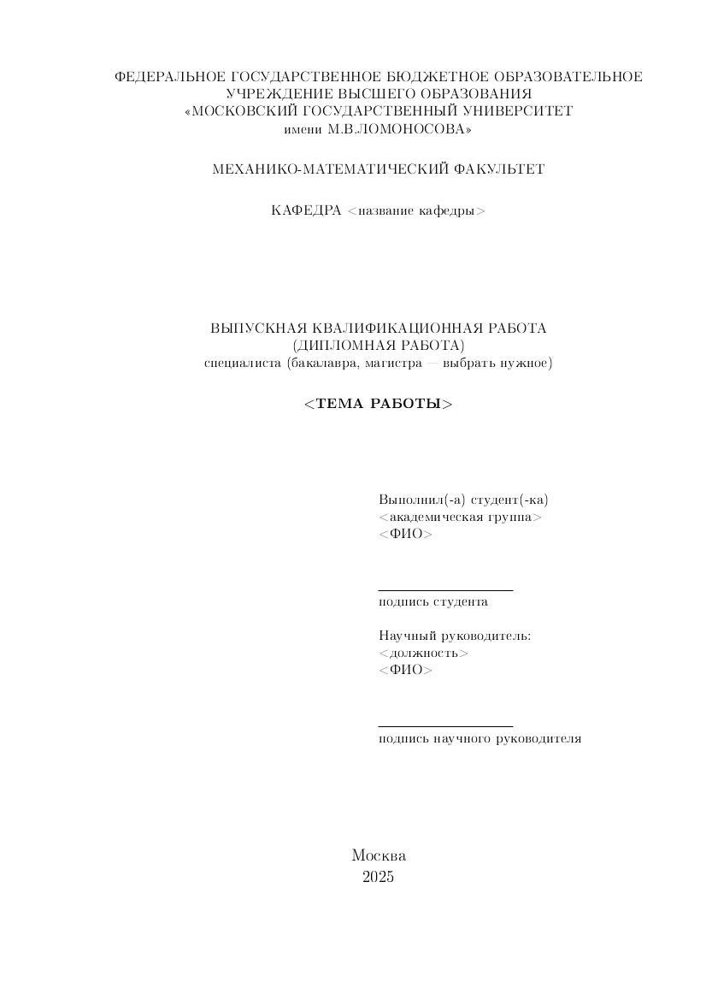

# Форма титульного листа Выпускной квалификационной работы

Содержимое формы на основе Приложения 1 из источника

[ТРЕБОВАНИЯ ВЫПУСКНОЙ КВАЛИФИКАЦИОННОЙ РАБОТЕ СТУДЕНТА МЕХАНИКО-МАТЕМАТИЧЕСКОГО ФАКУЛЬТЕТА МГУ](https://math.msu.ru/sites/default/files/trebovaniya_k_vkr_0.pdf).

В репозитории представлены два основных файла:
1. [`title.tex`](./title.tex) \
   Самостоятельный документ, который нужно копировать из этого репозитория в вашу рабочую директорию. 
2. [`main.tex`](./main.tex) \
   Здесь представлены:
   1. Конфигурация отступов в документе, соответствующая [ГОСТ 7.32-2017](https:///protect.gost.ru/document.aspx?control=7&id=218998).
   2. Пример включения файла `title.tex` в основной документ.

Собрать пример самостоятельно можно с помощью [latexmk](https://mgeier.github.io/latexmk.html)
```
latexmk -pdf main.tex
```
или, аналогично,
```
make
```


